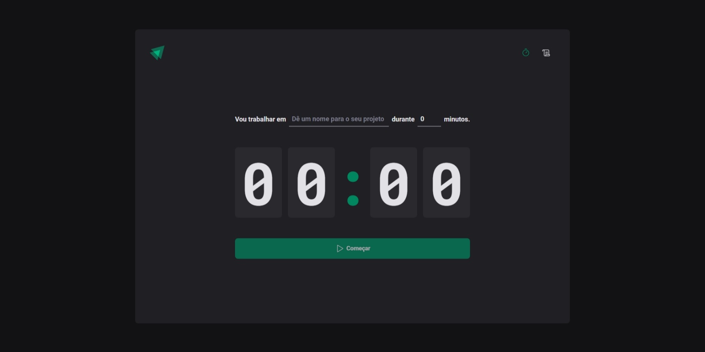

# Ignite-Timer

## 🦾 Tecnologias

- ReactJs com Typescript
- Immer
- Eslint
- React-Router-dom
- Date-fns
- zod
- ViteJS
- styled-components
- phospor-react
- Reducer
- Context
- Git e Github

## ⚙️ Sobre o projeto

- Foi feita uma aplicação no intuito de treinar as habilidades em um projeto novo junto as aulas da Rocketseat, sendo assim, produzindo uma aplicação de pomodoro

## ❤️ Contato

julionev@gmail.com
